# 🛠️ Karı Panel: Development Manual (v2026)

Welcome to the engine room. This guide provides the technical blueprint for running the full Karı orchestration stack on your local machine using Docker Compose.

## 🏗️ The Local Architecture

The stack consists of four primary boundaries:

1. **The Interface (SvelteKit)**: Port `5173` - Vite-powered dev server.
2. **The Brain (Go API)**: Port `8080` - Orchestrator and gRPC client.
3. **The Muscle (Rust Agent)**: Unix Socket - System manager and gRPC server.
4. **The Vault (Postgres)**: Port `5432` - Persistence layer.

---

### 🛡️ Karı Panel Operational Workflow

This Mermaid diagram illustrates the **Zero-Trust** path for a deployment request, highlighting the cryptographic boundaries and the gRPC handshake.

```mermaid
sequenceDiagram
    autonumber
    participant Admin as 💻 Admin Browser
    participant Svelte as ⚡ SvelteKit (UI)
    participant Brain as 🧠 Go API (Brain)
    participant DB as 🗄️ Postgres (Vault)
    participant Muscle as ⚙️ Rust Agent (Muscle)
    participant OS as 🐧 Linux Kernel (Jails)

    Note over Admin, Svelte: TLS 1.3 / JWT Auth
    Admin->>Svelte: Initiates Deployment (DeployButton.svelte)
    Svelte->>Svelte: Validate Input (Zod/Regex)
    
    Note over Svelte, Brain: Internal Backplane (HTTP/JSON)
    Svelte->>Brain: POST /api/v1/deployments (JWT forwarded)
    
    Brain->>Brain: AES-256-GCM Decrypt (SSH Keys/Secrets)
    Brain->>DB: Record Audit Log & State (Pending)
    
    Note over Brain, Muscle: Unix Domain Socket (gRPC)
    Brain->>Muscle: gRPC: CreateJail(AppConfig)
    
    Note right of Muscle: PeerCreds Verified (UID 1001)
    Muscle->>OS: Provision cgroup v2 & systemd-run
    OS-->>Muscle: Jail Created (PID Isolation)
    
    Muscle-->>Brain: Status: SUCCESS (Jail ID)
    Brain-->>Svelte: 202 Accepted (Trace ID)
    
    Note over Svelte, Admin: Server-Sent Events (SSE)
    Svelte->>Admin: Open Terminal (Stream Live Logs)
    Brain->>Admin: SSE Stream: "Pulling Git..." -> "Build Complete"

```



---

### 🏗️ Workflow Breakdown

1. **Frontend Entry**: The Admin initiates an action. SvelteKit handles the initial UX and ensures the operator has a valid, non-expired **JWT**.
2. **The Brain's Logic**: The Go API acts as the "Secure Custodian." It pulls the encrypted SSH keys from the Vault, decrypts them in memory using the **Master Key**, and prepares the payload for the Agent.
3. **The gRPC Handshake**: Communication happens over a **Unix Domain Socket** (`/var/run/kari/agent.sock`). The Muscle (Rust) performs a **Peer Credential** check to ensure the caller is indeed the Brain (UID 1001) before executing any privileged system commands.
4. **Hardware Enforcement**: The Muscle talks to the Linux kernel to set up `cgroups` (resource limits) and `namespaces` (filesystem isolation).
5. **Telemetry Loop**: Once the process is running, the Muscle streams logs back to the Brain, which proxies them via **SSE** directly to the `DeploymentTerminal.svelte` component.


---

## 🚀 Rapid Start (TL;DR)

```bash
# 1. Clone and enter
git clone https://github.com/your-org/kari-panel && cd kari-panel

# 2. Secure the perimeter (Generate .env with high-entropy keys)
chmod +x scripts/gen-secrets.sh
./scripts/gen-secrets.sh

# 3. Create the virtual root for the Muscle Agent
mkdir -p dev_root/var/www/kari dev_root/etc/kari/ssl

# 4. Ignite the stack
docker-compose up --build

```

---

## 🔧 gRPC Troubleshooting: Brain-to-Muscle Link

The most complex part of the Karı Panel is the **Unix Domain Socket (UDS)** bridge. Because the Muscle (Rust) and Brain (Go) communicate via a shared volume, permissions and socket state are critical.

### 1. Verify the Socket Physicality

The Brain will report `unhealthy` if the socket doesn't exist. Check the shared volume:

```bash
# Check if the socket file exists in the shared volume
docker exec kari-agent ls -la /var/run/kari/agent.sock

```

### 2. Peer Credential Mismatch

The Muscle enforces **Zero-Trust PeerCreds**. It checks if the UID of the process connecting (the Brain) matches the `KARI_EXPECTED_API_UID` (default: `1001`).

* **Symptom**: Brain logs show `rpc error: code = PermissionDenied`.
* **Fix**: Ensure `user: "1001:1001"` is set in `docker-compose.yml` for the `api` service.

### 3. The "Ghost Socket" Issue

If the Muscle crashes, it may leave a dead socket file behind, preventing a restart.

* **Symptom**: Agent logs show `Error: Address already in use`.
* **Fix**:
```bash
docker-compose down
rm ./kari_run/agent.sock # Manually clear the shared volume path
docker-compose up agent

```


---

## 🧪 Forensic Logging

To see exactly what the **Brain** is thinking versus what the **Muscle** is doing:

| Service | Command | Focus |
| --- | --- | --- |
| **Muscle** | `docker logs -f kari-agent` | Look for `Jail created` or `gRPC Handshake` |
| **Brain** | `docker logs -f kari-api` | Look for `DB Migration` or `Agent Dialing` |
| **UI** | `docker logs -f kari-ui` | Look for `SSR Fetch` or `JWT Verified` |

---

## 🛡️ Security & Privacy in Dev

* **Secret Zeroization**: Every time you run `./scripts/gen-secrets.sh`, your old local encryption keys are overwritten. **Warning**: This means any encrypted data in your local Postgres will become unreadable.
* **Isolation**: The `agent` container runs in `privileged` mode to allow it to manage `systemd` and `cgroups` within your `dev_root`. **Never run this container with public ports exposed.**

---

## 🏁 Quality Assurance (QA)

Before submitting a Pull Request, ensure the **2026 SLA** is met:

1. **Go**: `cd api && go test ./...`
2. **Rust**: `cd agent && cargo test`
3. **UI**: `cd frontend && npm run check`

---
