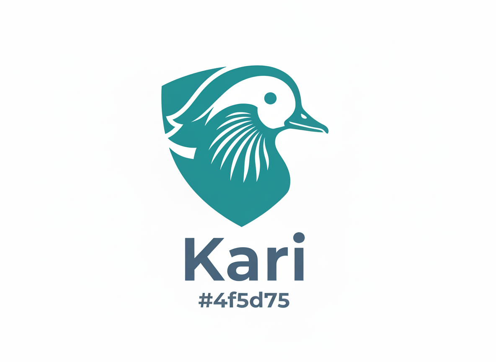
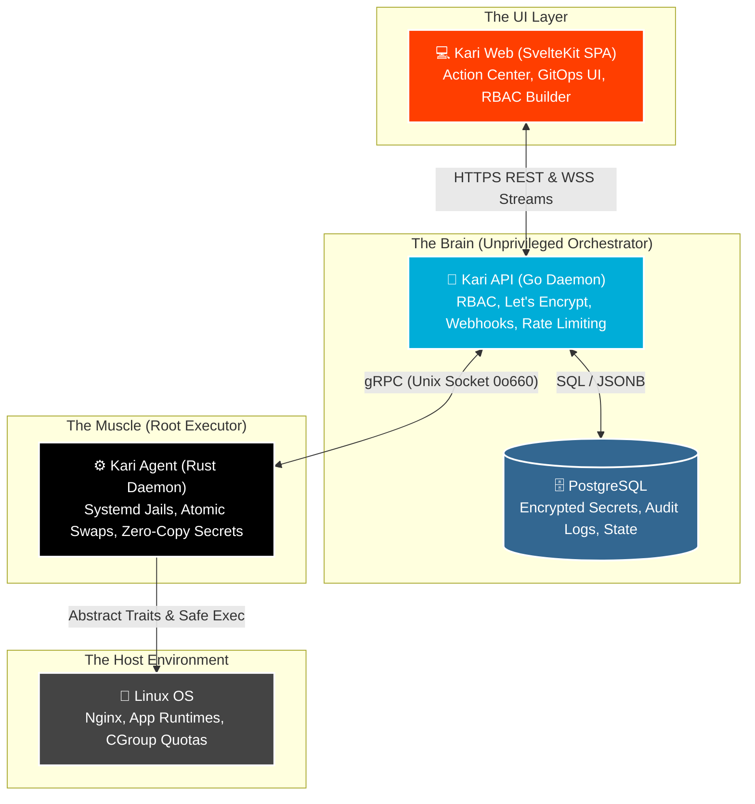

<div align="center">
  

  <h1>Karı — Made Simple. Designed Secure. </h1>
  <p>A fast, friendly control panel that installs in minutes and makes server management effortless, safe, and actually enjoyable. Get powerful tools, a clean interface, and complete control without the clutter.</p>

  <p>
    
    
    
    
    
    <br/>
    
    
    
  </p>
</div>

---

Karı is a next-generation server control panel built for the workflows of 2026 and beyond. Designed to replace legacy monolithic panels, Karı brings the seamless, GitOps-driven developer experience of platforms like Vercel or Railway directly to your own infrastructure. 

Built with an unprivileged **Go** REST API and a memory-safe, root-level **Rust** system agent, Karı acts as a **Platform-Agnostic Orchestration Engine**, offering blisteringly fast performance and an impenetrable security boundary.

## ✨ Core Features

* **Platform-Agnostic Orchestration:** The Go API dictates *intent* (Policies), while the Rust Agent handles OS-specific *execution* (Rules). Easily portable across Ubuntu, Debian, AlmaLinux, and Fedora.
* **GitOps by Default:** Native webhooks for GitHub/GitLab validated via constant-time HMAC SHA-256. Push to `main`, and Karı clones, builds, and swaps your app with zero-downtime atomic symlinks.
* **Systemd User Jails:** First-class support for Node.js, Python, PHP, and Ruby. Apps run isolated under unprivileged system users with strict cgroup quotas, `ProtectSystem=full`, and `PrivateTmp=true`.
* **Zero-Copy Secrets:** Provider tokens and TLS private keys are wrapped in Rust `secrecy` and `zeroize` memory guards. Keys are physically overwritten in RAM the millisecond they are no longer needed.
* **Automated Auto-Renewing SSL:** Native Let's Encrypt integration. Certificates are provisioned securely in memory, written directly to root-owned files, and auto-renewed by a background Go worker.
* **Dynamic RBAC:** Shift beyond static roles. Create custom permission sets with mathematical safeguards to prevent Super Admin lockouts.
* **Real-Time Observability:** End-to-end WebSockets stream deployment build logs directly to an XSS-proof `xterm.js` terminal UI in real-time.

---


## 🏗️ Architecture

Karı uses a strict privilege-separation model, splitting operations across three distinct boundaries to ensure absolute security and high performance. Data dictates behavior; there are zero hardcoded system paths or business defaults.



---

## 📂 Monorepo File Structure

```markdown
kari/
├── .github/workflows/          # CI/CD pipelines (Go build, Rust cross-compile, Svelte build)
├── agent/                      # The Muscle (Rust gRPC Daemon)
│   ├── Cargo.toml              
│   └── src/
│       ├── main.rs             # Entrypoint, secure Unix socket binding (0o660)
│       ├── config.rs           # Environment-injected dynamic paths (No hardcoded paths)
│       ├── server.rs           # gRPC SystemAgent implementation 
│       └── sys/                # System Integrations (SOLID SLAs)
│           ├── traits.rs       # Abstract interfaces (JobScheduler, FirewallManager, SslEngine)
│           ├── secrets.rs      # Zeroize/Secrecy memory wrappers for credentials
│           ├── scheduler.rs    # systemd timer concrete implementation
│           ├── jail.rs         # Linux user creation and filesystem lockdown
│           └── systemd.rs      # Generates secure systemd unit files (ProtectSystem=full)
├── api/                        # The Brain (Go REST API)
│   ├── cmd/kari-api/main.go    # App entrypoint (wires dependencies, starts workers/router)
│   ├── internal/
│   │   ├── config/config.go    # Centralized configuration (No hardcoded paths)
│   │   ├── adapters/           # Concrete implementations (SLA)
│   │   ├── api/                # HTTP Transport Layer (Middleware, Handlers, Router)
│   │   ├── core/               # Business Logic (SOLID)
│   │   │   ├── domain/         # Structs, Profile configs, & Repository Interfaces
│   │   │   └── services/       # Orchestrators (Auth, App, SSL)
│   │   ├── db/                 # PostgreSQL migrations and queries
│   │   ├── workers/            # Background cron jobs (SSL Renewer)
│   │   └── grpc/               # Generated Go gRPC client (from proto)
├── frontend/                   # The UI (SvelteKit SPA)
│   ├── package.json
│   ├── tailwind.config.ts      # Brand palette and typography mapping
│   └── src/
│       ├── hooks.server.ts     # Server-side JWT gatekeeper, silent refresh logic
│       ├── lib/                # Shared UI utilities and components
│       │   ├── api/            # Frontend SLA Layer (client.ts, terminalStream.ts)
│       │   └── components/     # SRP UI Components (DeploymentTerminal, EnvironmentEditor)
│       └── routes/             # Filesystem Routing
│           ├── (app)/          # Authenticated routes & +layout.svelte shell
│           └── (auth)/         # XSS-proof form actions
├── proto/                      # The Contract
│   └── kari/agent/v1/agent.proto # Abstract intent definitions (FirewallPolicy, JobIntent)
├── scripts/                    # DevOps & DX
└── docker-compose.yml          

```

---

## 🚀 Quick Install

To install Karı on a fresh Linux server, run our idempotent bootstrap script as `root`. This will automatically detect your OS, install baseline dependencies, configure PostgreSQL, and download the pre-compiled static binaries with an automatic CDN failover.

```bash
curl -sSL [https://raw.githubusercontent.com/irgordon/kari/main/scripts/install.sh](https://raw.githubusercontent.com/irgordon/kari/main/scripts/install.sh) | sudo bash

```

*(Supports Ubuntu 22.04/24.04, Debian 12, AlmaLinux 9, and Fedora)*

---

## 🛠️ Local Development

### Prerequisites

* Go 1.22+
* Rust (Stable) + Cargo
* Node.js 20+
* PostgreSQL 16+
* Protocol Buffers Compiler (`protoc`)

### Getting Started

1. **Clone the repository:**

```bash
git clone [https://github.com/irgordon/kari.git](https://github.com/irgordon/kari.git)
cd kari

```

2. **Generate the gRPC Protobufs:**
Ensure the contract between Go and Rust is up to date.

```bash
make proto-gen

```

3. **Start the development services:**
You can run the full stack locally using our provided script:

```bash
./scripts/dev.sh

```

* *Frontend:* `http://localhost:5173`
* *Go API:* `http://localhost:8080`

---

## 🛡️ Security

Security is the foundational principle of Karı. We utilize a strict two-token JWT architecture (HttpOnly cookies for the browser UI, and Personal Access Tokens for CLI usage), AES-256-GCM encryption for database secrets, and memory-safe Rust execution.

If you discover a security vulnerability, please do **NOT** open a public issue. Email `security@kariapp.dev` directly.

---

## 📄 License

This project is licensed under the **[MIT License](https://mit-license.org/)**.

© 2026 Karı Project - *Made Simple. Designed Secure.*

```
