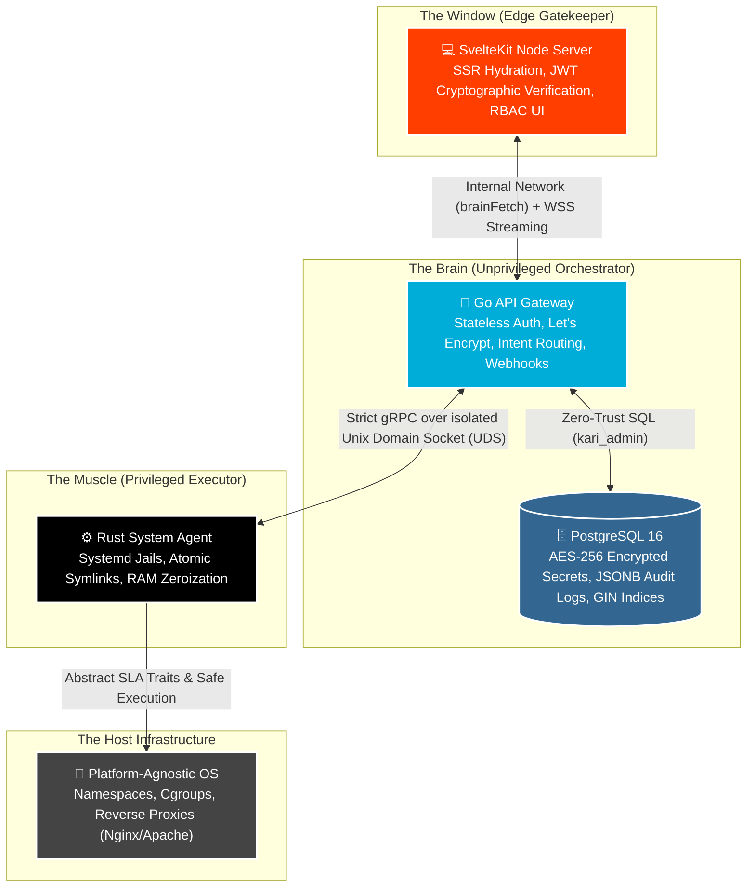

<div align="center">
  

  <h1>Karı — Made Simple. Designed Secure. </h1>
  <p>A fast, friendly control panel that installs in minutes and makes server management effortless, safe, and actually enjoyable. Get powerful tools, a clean interface, and complete control without the clutter.</p>

  <p>
    <a href="https://github.com/irgordon/kari/actions"></a>
    <a href="https://github.com/irgordon/kari/releases"></a>
    <a href="https://github.com/irgordon/kari/blob/main/LICENSE"></a>
  </p>

  <p>
    
    
    
    
    
    
    
  </p>
</div>

---

Karı is a next-generation server control panel built for the strict security and performance demands of today's computing environment. Designed to replace legacy, vulnerable monolithic panels, Karı brings the seamless developer experience of platforms like Vercel or Railway directly to your own infrastructure.

Built with an unprivileged **Go** REST API and a memory-safe, root-level **Rust** system agent communicating exclusively over an isolated Unix Domain Socket, Karı acts as a **Platform-Agnostic Orchestration Engine**, offering blisteringly fast performance and an impenetrable security boundary.

## ✨ Core Features

* **Platform-Agnostic Orchestration:** The Go API dictates *intent* (Policies), while the Rust Agent handles OS-specific *execution* (Rules). Easily portable across Ubuntu, Debian, AlmaLinux, and Fedora without altering core business logic.
* **Air-Gapped Execution:** The Go Brain orchestrator runs entirely unprivileged (`NoNewPrivileges=true`). It cannot touch the host filesystem or execute arbitrary commands. It delegates strictly typed gRPC requests to the Muscle over a closed socket.
* **GitOps by Default:** Native webhooks for GitHub/GitLab validated via constant-time HMAC SHA-256. Push to `main`, and Karı securely clones, builds, and swaps your application into production using zero-downtime atomic symlinks.
* **Zero-Trust Systemd Jails:** First-class support for Node.js, Python, PHP, and Ruby. Tenant applications run completely isolated under unprivileged system users with strict cgroup quotas, `ProtectSystem=strict`, `RestrictSUIDSGID=true`, and `PrivateTmp=true`.
* **Cryptographic Memory Guards:** Provider tokens and TLS private keys are wrapped in Rust `secrecy` and `zeroize` types. Highly sensitive keys are physically overwritten in RAM the millisecond they are successfully flushed to disk.
* **Automated Auto-Renewing SSL:** Native Let's Encrypt (ACME) integration. Certificates are provisioned securely in memory, written directly to root-owned paths, and auto-renewed by a background Go worker before expiration.
* **Dynamic RBAC & Action Center:** Cryptographically signed, stateless JWTs enforce rank-based permissions at the edge, preventing privilege escalation. High-performance observability is powered by GIN-indexed JSONB system alerts in PostgreSQL.
* **Real-Time Observability:** End-to-end WebSockets stream deployment build logs directly from the Linux host to an XSS-proof `xterm.js` terminal UI inside the SvelteKit dashboard in real-time.

---

<p>
  <a href="#-the-architecture">Architecture</a> •
  <a href="#-platform-agnosticism">Platform Agnosticism</a> •
  <a href="#-installation">Installation</a> •
  <a href="#-documentation">Documentation</a> •
  <a href="#-contributing">Contributing</a>
</p>

---

## 🏗️ Architecture

Karı operates on a strict **Zero-Trust** model, physically and logically separating the user interface, the business logic, and the system-level execution. It is built on three highly optimized pillars:

1. **The Window (SvelteKit & Node.js):** A progressively enhanced, SSR-driven frontend. It handles stateful UI hydration and granular Role-Based Access Control (RBAC) via cryptographically verified local JWTs.
2. **The Brain (Go & PostgreSQL):** The stateless API gateway. It handles authentication, Let's Encrypt (ACME) orchestration, and database persistence. It never touches the host OS directly.
3. **The Muscle (Rust):** The execution engine. Running as a privileged daemon, it receives gRPC commands from the Brain over a secure, isolated Unix Domain Socket (UDS) to manage Linux namespaces, proxies, and SSL certificates. It zeroizes memory after handling private keys.



---

## 📂 Monorepo File Structure

```markdown
kari/
├── .github/
│   └── workflows/
│       └── release.yml           # CI/CD: Cross-compiles Rust (via cross), builds Go binaries, pushes multi-arch GHCR Docker images
├── docs/                         # Architectural Source of Truth
│   ├── ARCHITECTURE.md           # 3-tier Zero-Trust model explanation
│   ├── AGENT_API.md              # gRPC protocol buffer schema documentation
│   ├── PROVIDERS.md              # Plugin/Adapter interfaces (DNS, Let's Encrypt, Nginx)
│   └── SYSTEM_CHECK.md           # Linux host requirements and dependency matrix
├── agent/                        # The Muscle (Rust gRPC Daemon - Privileged Execution)
│   ├── Dockerfile                # Distroless/Alpine runtime for containerized mode
│   ├── Cargo.toml                # Dependencies: tonic (gRPC), tokio, zeroize, openssl
│   └── src/
│       ├── main.rs               # Entrypoint, secure Unix Domain Socket (UDS) binding
│       ├── config.rs             # Environment-injected dynamic paths (SLA compliance)
│       ├── server.rs             # gRPC SystemAgent implementation routing intents to sys layer
│       └── sys/                  # System Integrations (Linux OS manipulation)
│           ├── traits.rs         # Abstract interfaces for testing (ProxyManager, SslEngine)
│           ├── secrets.rs        # Memory wrappers (Zeroize) to securely wipe PEM/Key buffers
│           ├── jail.rs           # Linux namespace/cgroup management and user isolation
│           └── systemd.rs        # Generates hardened systemd units (ProtectSystem=strict)
├── api/                          # The Brain (Go REST API - Stateless Orchestrator)
│   ├── Dockerfile                # Multi-stage scratch/alpine build (CGO_ENABLED=0)
│   ├── go.mod
│   ├── cmd/kari-api/main.go      # App entrypoint (wires DB, TokenService, starts HTTP/gRPC)
│   └── internal/
│       ├── config/config.go      # Environment variable ingestion (JWT_SECRET, DATABASE_URL)
│       ├── core/                 # Business Logic (SOLID)
│       │   ├── domain/           # Structs (User, App), Enums, & Repository Interfaces
│       │   └── services/         # Orchestrators (Auth/TokenService, App Deployment)
│       ├── db/                   # PostgreSQL implementation (pgxpool) and raw SQL queries
│       ├── handlers/             # HTTP Handlers (REST endpoints, cookie management)
│       │   └── auth_handler.go   # Refresh token rotation, cookie setting/clearing
│       └── grpc/                 # Generated Go gRPC client code to talk to the Muscle
├── frontend/                     # The Window (SvelteKit UI - Zero-Trust SPA)
│   ├── Dockerfile                # Multi-stage Node.js build (adapter-node, rootless user)
│   ├── package.json
│   ├── svelte.config.js          # Configures adapter-node and precompression
│   ├── vite.config.ts            # Configures 0.0.0.0 binding and esbuild log dropping
│   ├── tailwind.config.js        # Brand palette, typography, and JIT CSS purging
│   ├── postcss.config.js         # Autoprefixer for cross-browser CSS compatibility
│   └── src/
│       ├── hooks.server.ts       # Edge gatekeeper: Stateless JWT cryptographic verification (jose)
│       ├── lib/
│       │   ├── server/api.ts     # internal brainFetch wrapper for Docker network communication
│       │   └── utils/auth.ts     # Client-side RBAC evaluation logic (canPerform)
│       └── routes/
│           ├── +layout.server.ts # Serializes sanitized user state down to Svelte stores
│           ├── (app)/            # Authenticated routes (Dashboard, Apps, Logs)
│           └── login/            # Progressive enhancement forms with auth state retention
├── proto/                        # The Contract (Language-Agnostic Schema)
│   └── kari/v1/agent.proto       # Protocol Buffer definitions for UDS communication
├── dev.sh                        # Developer DX: Host-level routing, mock paths, Vite HMR
├── up.sh                         # Integration DX: Docker Compose stack builder and logger
├── install.sh                    # Bare-Metal DX: systemd sandboxing, umask 027, rootless users
└── docker-compose.yml            # Production-grade isolated network, UDS volume sharing   

```

---

## 🚀 Quick Install (Bare-Metal)

To install Karı on a fresh Linux server, run our idempotent bootstrap script as `root`. This handles OS detection, dependency bootstrapping, strict directory permissioning (`umask 027`), and kernel-level systemd sandboxing automatically.

```bash
curl -sSL https://raw.githubusercontent.com/irgordon/kari/main/install.sh | sudo bash

```

## 🌍 Platform Agnosticism

Karı doesn't care where it runs. It is designed to abstract away the underlying infrastructure so you can deploy your applications seamlessly across:
* **Bare-Metal Servers & VMs** (Debian, Ubuntu, RHEL)
* **ARM Clusters** (AWS Graviton, Raspberry Pi)
* **Containerized Environments** (Docker Compose swarms)

By implementing the Single Layer Abstraction (SLA) principle, adding a new reverse proxy (e.g., swapping Nginx for Caddy) or a new DNS provider requires zero changes to the Go Brain or the SvelteKit UI. You simply drop a new provider interface into the Rust Muscle.


---

## 🛠️ Local Development

Our developer experience is engineered for speed and determinism. We provide two distinct workflows depending on your testing needs.

### Prerequisites

* Docker & Docker Compose (v2+)
* Go 1.22+
* Rust (Stable) + Cargo
* Node.js 20+
* Protocol Buffers Compiler (`protoc`)

### Getting Started

1. **Clone the repository:**

```bash
git clone https://github.com/irgordon/kari.git
cd kari

```

2. **Generate the gRPC Protobufs:**

```bash
make proto-gen

```

3. **Choose your Execution Model:**

**Option A: Fast Iteration (Native Host)**
Spins up PostgreSQL via Docker, but runs the Go Brain, Rust Muscle, and SvelteKit UI natively on your machine with mocked filesystem paths (no `sudo` required). Perfect for UI work and instant Hot Module Replacement (HMR).

```bash
./dev.sh

```

**Option B: Full Integration (Containerized)**
Compiles the optimized, multi-stage Dockerfiles and boots the entire Zero-Trust architecture inside an isolated Docker Compose network. Identical to a containerized production deployment.

```bash
./up.sh

```

---

## 🛡️ Security & Zero-Trust Architecture

Security is the foundational principle of Karı. We do not trust the network, we do not trust the user, and our internal services do not even trust each other.

* **Air-Gapped Execution:** The Go Brain handles web traffic as an unprivileged, restricted user (`NoNewPrivileges=true`, empty `CapabilityBoundingSet`). It cannot touch the host OS.
* **Hermetic gRPC:** The Go Brain and the Rust Muscle communicate *exclusively* over a local Unix Domain Socket (UDS). There is zero internal network exposure for the execution engine.
* **Systemd Sandboxing:** On bare-metal deployments, the API orchestrator is locked inside a `ProtectSystem=strict` sandbox, rendering the entire host filesystem read-only.
* **Memory Safety & Cryptography:** We utilize memory-safe Rust execution with proactive RAM zeroization (`zeroize` crate) for all private keys, AES-256-GCM encryption for database secrets, and a strict two-token JWT architecture (HttpOnly cookies for the browser UI, and Personal Access Tokens for CLI usage).

If you discover a security vulnerability, please do **NOT** open a public issue. Email `security@kariapp.dev` directly.

---

## 🛠️ Local Development

Building Karı locally is designed to be frictionless. Our local bootstrapper spins up the database in Docker, mocks the Linux filesystem so the Rust agent can run without `sudo`, and hot-reloads the SvelteKit UI.

```bash
./dev.sh

```

---

## 📚 Documentation

Dive deeper into the engineering principles behind Karı:

* [Architecture & Security Model](https://www.google.com/search?q=docs/ARCHITECTURE.md)
* [The Muscle API (gRPC Schema)](https://www.google.com/search?q=docs/AGENT_API.md)
* [Provider Integrations](https://www.google.com/search?q=docs/PROVIDERS.md)
* [System Requirements & Pre-flight Checks](https://www.google.com/search?q=docs/SYSTEM_CHECK.md)

---

## 🤝 Contributing

We welcome contributions! Please review our [Contributing Guidelines](https://www.google.com/search?q=CONTRIBUTING.md) before submitting pull requests. Ensure your code complies with our strict Zero-Trust and SLA principles.

## 📄 License

This project is licensed under the **[MIT License](https://mit-license.org/)**.

© 2026 Karı Project - *Made Simple. Designed Secure.*

---
